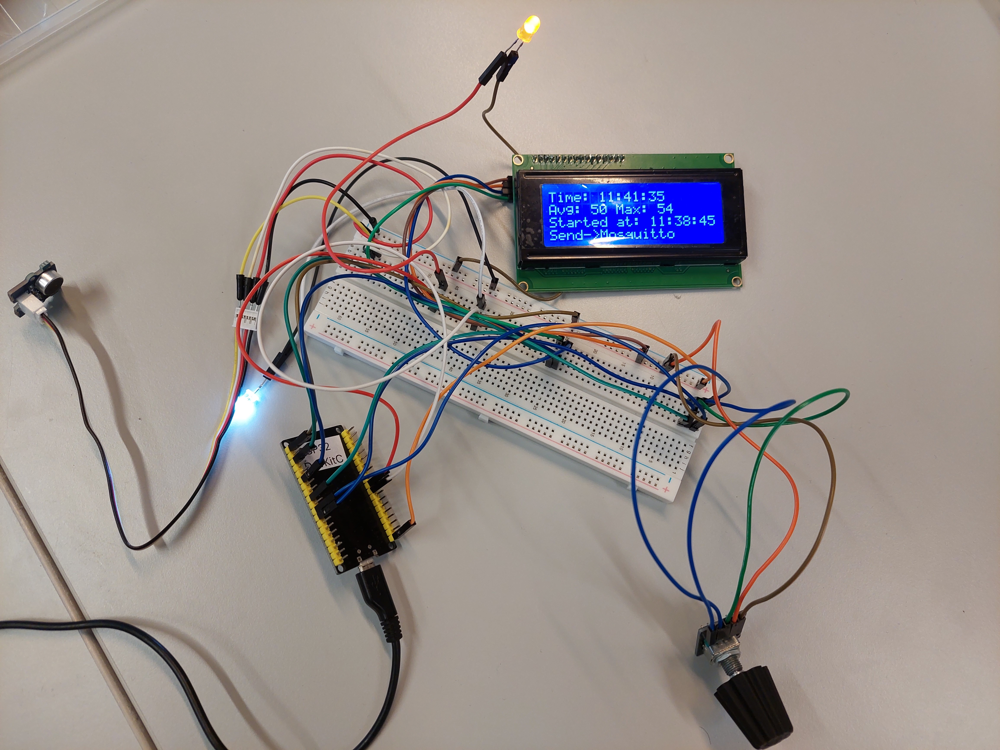
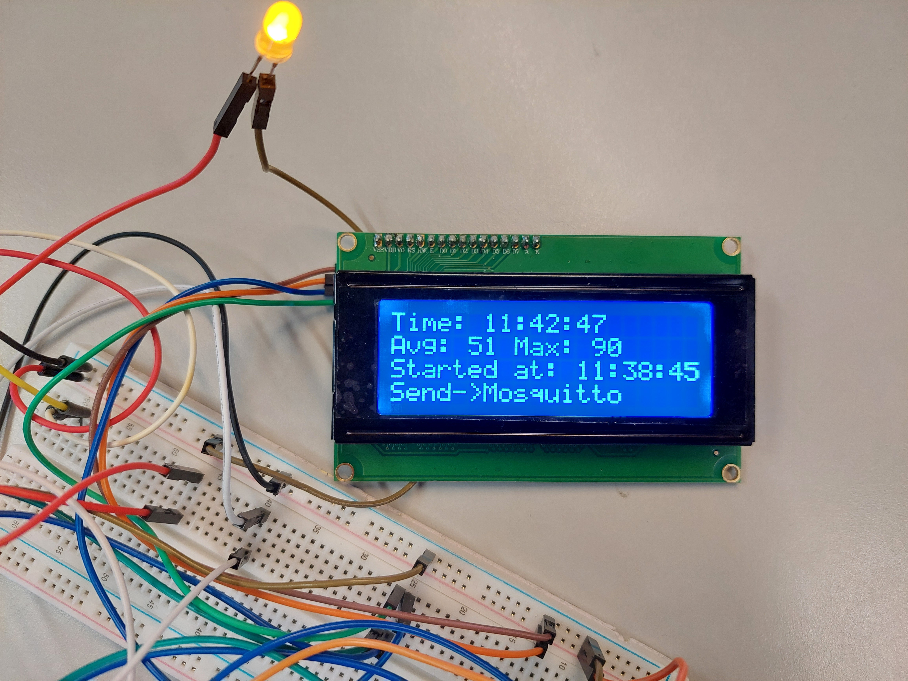
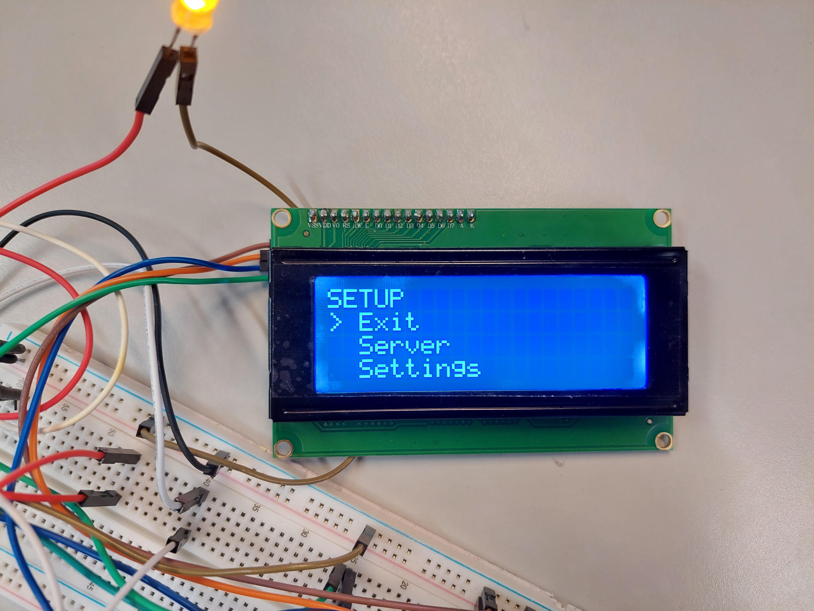
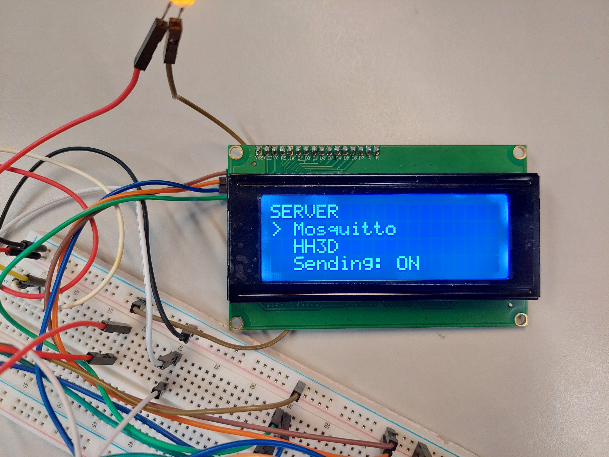
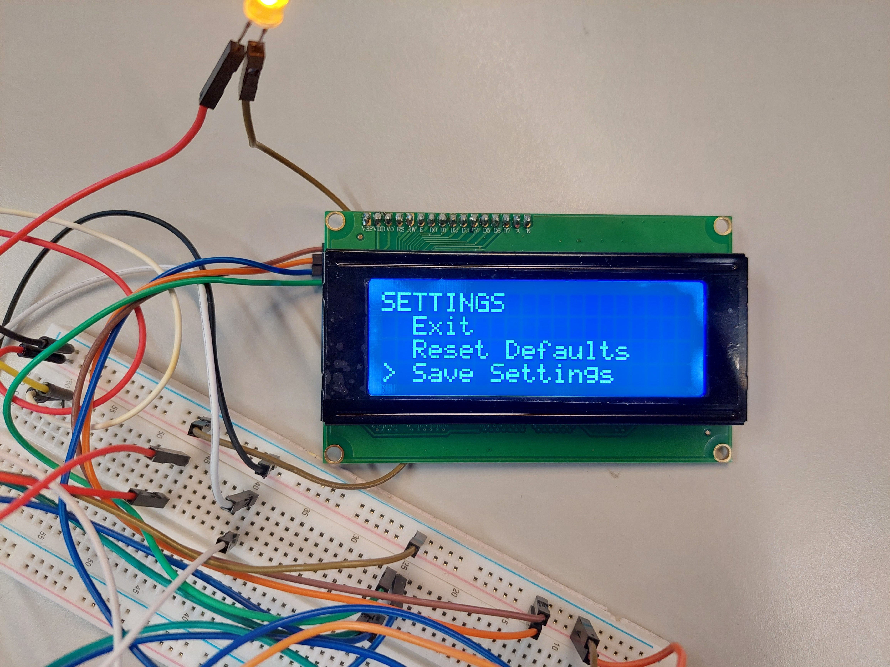

# Experimental-IoT Project

Code for ESP32 devices created for the course Experimental IoT Project at Haaga-Helia.

## sound_sensor_display_mqtt_controls

*Code for the main device of the course*

The device consists of an Esp32 board, bread board, 2 led lights, noise sensor, 4 line LCD screen, and a rotary encoder.

The program's main loop is built around 10 second windows for taking and reporting noise readings. The results are always printed on the screen.

If sending is on, the results are also sent to either a local server or to an mqtt broker depending on the chosen destination.

Menu screens are accessed by pressing the button on the rotarory encoder which acts as an interrupt.

There are 3 separate menus: main menu, server menu, and settings menu.

### Main menu

For choosing a sub menu.

### Server menu

For toggling sending status and choosing destination.

### Settings menu

For saving current settings to local storage or resetting to default settings.

The saved settings are loaded on device reboot if the file can be found.

### Environment

Certain settings are read from *env.h* file which should be in the following format:

**env.h**

```
const char* ENV_SSID = "network_name";
const char*  ENV_PASSWORD = "network_password";
const char* ENV_URL = "local_target_url";
const char* ENV_BROKER = "broker_url";
const int ENV_PORT = 1883;
const char* ENV_TOPIC = "topic/name";
const char* ENV_LOCATION = "location_name";
const char* ENV_SENDER = "sender_name_for_local_sending";

```

### Pictures

#### Full device



#### Main screen



#### Menu



#### Server menu



#### Settings menu



## Client app

Up to date client repository: https://github.com/jaolim/mqtt-client

Published client: https://jaolim.github.io/mqtt-client/

